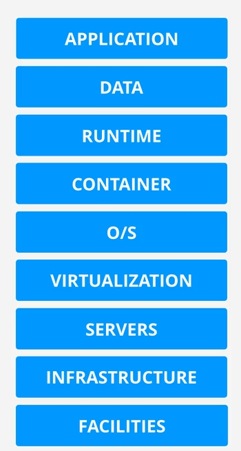

# 2. Cloud Computing Fundamentals

## 2.1 Cloud Computing - What is it ... really
### 5 Essential Characteristics of Cloud Computing
- Capabilities: features or products (ex: virtual machines, storage, or networking)
1. **On-Demand Self-Service**
    - Can provision capabilities as needed without requiring human interaction.
2. **Broad Network Access**
    - Capabilities are available over the network and accessed through standard mechanisms.
3. **Resource Pooling**
    - There is a sense of location independence which means there is no control or knowledge over the exact location of the resources.
    - Resources are pooled to serve multiple consumers using a multi-tenant model.
4. **Rapid Elasticity**
    - Capabilities can be elastically provisioned and released to scale rapidly outward and inward with demand.
    - To the consumer, the capabilities available for provisioning often appear to be unlimited.
5. **Measured Service**
    - Resource usage can be monitored, controlled, reported and BILLED.

### Key Points Summarized
1. **On-Demand Self-Service**: Provision and terminate using a UI / CLI without human interaction.
2. **Broad Network Access**: Access services over any networks, on any devices, using standard protocols and methods.
3. **Resource Pooling**: Economies of scale, cheaper service.
4. **Rapid Elasticity**: Scale UP (OUT) and DOWN (IN) automatically in response to system load.
5. **Measured Service**: Usage is measured. Pay for what you consume.

## 2.2 Public vs. Private vs. Multi vs. Hybrid Cloud
- **Public Cloud**: Cloud environment available to the public. (ex: AWS, Azure, GCP)
- **Multi-Cloud**: Using multiple cloud environments, generally used when part of your infrastructure is in one cloud environment and part in another.
- **Private Cloud**: On-premises cloud that is dedicated to your business. (ex: AWS Outposts, Azure Stack, Google Anthos)
- **Hybrid Cloud**: Using both public and private cloud as a single environment.
\
&nbsp;
- Note: Hybrid Environment != Hybrid Cloud
    - Hybrid Environment (Hybrid Networking): Connecting a public cloud environment through to your on-premises data center-based traditional infrastructure.

### Key Points Summarized
- **Public CLoud**: using 1 public cloud
- **Private Cloud**: using on-premises *real* cloud (needs to meet 5 essential characteristics)
- **Multi-Cloud**: using more than 1 public cloud
- **Hybrid Cloud**: Public and Private Clouds (Hybrid Cloud is NOT public cloud + legacy on-premises) 

## 2.3 Cloud Service Models (X as a Service)
### Terms & Concepts
- Infrastructure Stack: a collection of things which an application needs
    - There are parts of the stack that you manage and parts managed by the vendor

- Unit of consumption: What you pay for and what you consume
    - If you pay for a virtual server, your unit of consumption is the virtual machine, which is just an operating system.
    - If you pay for Netflix, you are consuming the service, you are not managing any part of it.

### On-Premises vs DC Hosted
- On-Premises: Your business has to pay for and manage the whole stack.
- DC Hosted (Data Center Hosted): The facilities are owned and managed by a vendor, but you pay for and manage everything else.

### X as a Service
- **Infrastructure as a Service (IaaS)**: You pay for a virtual machine and manage the operating system and everything above it. Everything else is handled by the vendor.
- **Platform as a Service (PaaS)**: You pay for a runtime environment to run an application. (ex: Pay for Python Runtime Environment to run Python applications)
- **Software as a Service (SaaS)**: You consume the application with no exposure to anything else. (ex: Netflix, Dropbox, Office 365, etc.)